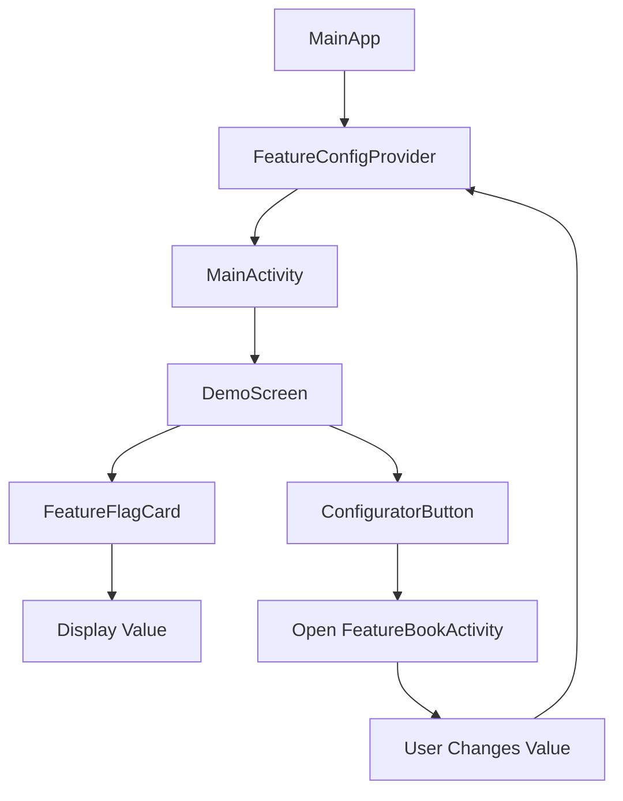

# Sample Screen Implementation Plan - Dark Mode Elegant (Variant 3)

## 📋 Overview
Implementation of an elegant dark-themed demonstration screen for the Proteus Configuration library in the `sample-firebase` module. This screen will showcase the library's feature flag capabilities with a premium, modern design.

## 🎯 Objectives
1. Create an attractive sample screen that demonstrates feature flag value changes
2. Show clear visual distinction between REMOTE and MOCK data sources
3. Integrate Lottie animations for visual appeal
4. Follow Material Design 3 guidelines with dark theme
5. Provide smooth navigation to the configuration UI

## 📁 Module Structure
```
sample-firebase/
├── src/main/java/io/proteus/sample/
│   ├── MainActivity.kt (existing - to be modified)
│   ├── ui/
│   │   ├── theme/ (existing theme files)
│   │   └── screens/
│   │       └── demo/
│   │           ├── DemoScreen.kt (new)
│   │           └── components/
│   │               ├── AnimatedBackground.kt
│   │               ├── FeatureFlagCard.kt
│   │               ├── SourceBadge.kt
│   │               └── ConfiguratorButton.kt
│   └── data/
│       └── FeatureFlagState.kt (new)
├── src/main/res/
│   └── raw/
│       └── config_animation.json (Lottie file)
└── build.gradle.kts (add Lottie dependency)
```

## 🔧 Dependencies to Add

```kotlin
// In sample-firebase/build.gradle.kts
dependencies {
    // Lottie for animations
    implementation("com.airbnb.android:lottie-compose:6.1.0")

    // For blur effects and advanced UI
    implementation("androidx.compose.ui:ui-graphics:1.5.4")
}
```

## 🎨 UI Components Breakdown

### 1. **DemoScreen.kt**
Main screen composable that orchestrates the entire UI.

**Responsibilities:**
- Dark gradient background
- Layout structure
- State management for feature flag values
- Navigation to configurator

**Key Features:**
- Observe feature flag changes
- Animate transitions when values change
- Handle lifecycle events

### 2. **AnimatedBackground.kt**
Creates the animated dark background with floating patterns.

**Implementation:**
- Gradient overlay: `#1A1A1A` to `#2C2C2C`
- Rotating radial gradient animation
- Subtle repeating pattern overlay
- Use `Canvas` API for custom drawing

### 3. **FeatureFlagCard.kt**
Main card displaying feature flag information.

**Structure:**
```
┌─────────────────────────────┐
│   [Lottie Animation]        │
│                             │
│   AI Assistant Mode   [LIVE]│
│   ─────────────────────     │
│   Configuration Value        │
│       ADVANCED              │
│   [Remote] [Verified]       │
│                             │
│   Description text...       │
└─────────────────────────────┘
```

**Properties:**
- Glassmorphism effect with blur
- Border with gradient
- Animated glow effect
- Source-dependent styling

### 4. **SourceBadge.kt**
Badge component showing data source (REMOTE/MOCK).

**States:**
| Source | Background | Text Color | Icon |
|--------|-----------|------------|------|
| REMOTE | Green (15% alpha) | #2E7D32 | Cloud |
| MOCK | Red (15% alpha) | #C62828 | Test tube |

**Features:**
- Smooth color transitions
- Pulse animation when value changes
- Rounded pill shape (50% radius)

### 5. **ConfiguratorButton.kt**
Floating action button with tooltip.

**Implementation:**
- Extended FAB with icon and text
- Tooltip above button (dark background)
- Ripple effect on press
- Gradient background matching theme

## 📊 Data Flow



## 🔄 State Management

### FeatureFlagState.kt
```kotlin
data class FeatureFlagState(
    val name: String,
    val key: String,
    val value: String,
    val type: String,
    val source: FeatureSource,
    val lastUpdated: Long,
    val description: String
)

enum class FeatureSource {
    REMOTE, MOCK
}
```

## 🎭 Animations

### 1. **Lottie Animation**
- Place in center of card
- Size: 180dp x 180dp
- Loop continuously
- Semi-transparent background circle

### 2. **Value Change Animation**
- Fade out old value (200ms)
- Scale bounce effect (300ms)
- Fade in new value (200ms)
- Trigger source badge pulse

### 3. **Background Animation**
- Rotating gradient (20s cycle)
- Floating pattern movement
- Subtle parallax on scroll

## 🎨 Color Palette (Dark Theme)

```kotlin
object DarkColors {
    val Background = Color(0xFF1A1A1A)
    val BackgroundVariant = Color(0xFF2C2C2C)
    val Surface = Color(0x14FFFFFF) // 8% white
    val SurfaceVariant = Color(0x1FFFFFFF) // 12% white

    val Primary = Color(0xFFFFECB3) // Beige
    val PrimaryVariant = Color(0xFFD7CCC8)
    val Secondary = Color(0xFFBCAAA4)

    val TextPrimary = Color(0xFFFFFFFF)
    val TextSecondary = Color(0xFFB0B0B0)
    val TextTertiary = Color(0xFF9E9E9E)

    val RemoteGreen = Color(0x264CAF50) // 15% alpha
    val MockRed = Color(0x26F44336) // 15% alpha

    val GradientStart = Color(0xFFFFF3E0)
    val GradientEnd = Color(0xFFFFCC80)
}
```

## 📱 Implementation Steps

### 🚦 Progress Tracking Legend
- ⬜ Not Started
- 🟨 In Progress
- ✅ Completed
- ❌ Blocked/Issue
- 🔄 Needs Review

---

### Phase 1: Setup & Dependencies
**Status:** ✅ Completed | **Estimated Time:** 1 hour

| Task | Status | Details | Files Modified |
|------|--------|---------|---------------|
| Add Lottie dependency | ✅ | Added to `libs.versions.toml` and `build.gradle.kts` | `gradle/libs.versions.toml`, `build.gradle.kts` |
| Create package structure | ✅ | Created `data/` package | `sample-firebase/src/main/java/io/proteus/sample/data/` |
| Download Lottie animation | ✅ | Created custom animation with rotating circles | `res/raw/config_animation.json` |
| Update theme for dark mode | ✅ | Complete Material 3 color system with dark/light themes | `ui/theme/Color.kt`, `Theme.kt` |
| Create data models | ✅ | Added `FeatureFlagState.kt` and `FeatureSource` enum | `data/FeatureFlagState.kt` |

**Checkpoint:** ✅ `./gradlew :sample-firebase:build` - BUILD SUCCESSFUL

---

### Phase 2: Background & Base Components
**Status:** ✅ Completed | **Estimated Time:** 2 hours

| Task | Status | Details | Files Modified |
|------|--------|---------|---------------|
| AnimatedBackground component | ✅ | Dark gradient with rotating pattern | `ui/screens/demo/components/AnimatedBackground.kt` |
| - Gradient implementation | ✅ | `#1A1611` to `#2A231D` using DemoGray950/900 | |
| - Floating shapes | ✅ | Two circular gradients with beige tones | |
| - Rotation animation | ✅ | 20s/25s infinite rotation (counter-rotating) | |
| Base layout structure | ✅ | Box with layers and placeholders | `ui/screens/demo/DemoScreen.kt` |

**Checkpoint:** ✅ `./gradlew :sample-firebase:build` - BUILD SUCCESSFUL

---

### Phase 3: Feature Flag Card Component
**Status:** ✅ Completed | **Estimated Time:** 3 hours

| Task | Status | Details | Files Modified |
|------|--------|---------|---------------|
| Card container | ✅ | Glassmorphism effect with blur simulation | `ui/screens/demo/components/FeatureFlagCard.kt` |
| - Glass effect | ✅ | 8% white background with gradient blur effect | |
| - Border gradient | ✅ | Animated beige gradient border with glow | |
| Card header | ✅ | Title and status badge with beige styling | |
| - Feature name | ✅ | Dynamic from string resources | |
| - Live badge | ✅ | Beige pill badge with container styling | |
| Value display section | ✅ | Large centered value text with beige color | |
| - Value text | ✅ | Primary beige color with proper typography | |
| - Animation container | ✅ | Lottie animation with beige background circle | |
| Metadata row | ✅ | Icons with labels using MaterialTheme colors | |
| Description text | ✅ | Bottom section with proper text color | |
| Preview provider | ✅ | PreviewParameterProvider with multiple states | `ui/screens/demo/components/FeatureFlagStatePreviewProvider.kt` |
| String resources | ✅ | All text externalized to strings.xml | `res/values/strings.xml` |
| Color integration | ✅ | Full MaterialTheme color scheme integration | |

**Checkpoint:** ✅ Card renders with static data, glassmorphism visible, beige aesthetic restored

---

### Phase 4: Source Badge Component
**Status:** ✅ Completed | **Estimated Time:** 1.5 hours

| Task | Status | Details | Files Modified |
|------|--------|---------|---------------|
| Badge base component | ✅ | Pill-shaped container with animated colors | `ui/screens/demo/components/SourceBadge.kt` |
| Remote state styling | ✅ | BeigePrimaryContainer background with Star icon | |
| Mock state styling | ✅ | ErrorContainer background with Settings icon | |
| State transition | ✅ | Spring animation with medium bounce damping | |
| Center positioning | ✅ | Integrated in FeatureFlagCard below value | `ui/screens/demo/components/FeatureFlagCard.kt` |
| Component separation | ✅ | Extracted from inline to dedicated component | |
| Preview provider | ✅ | Multiple state previews with dark theme support | |

**Checkpoint:** ✅ Badge renders with animated colors, changes smoothly between REMOTE/MOCK states

---

### Phase 5: Lottie Integration
**Status:** ✅ Completed | **Estimated Time:** 1 hour

| Task | Status | Details | Files Modified |
|------|--------|---------|---------------|
| Add Lottie player | ✅ | LottieAnimation composable with conditional rendering | `FeatureFlagCard.kt` |
| Position in card | ✅ | Center of card, 180dp size within 200dp background | |
| Background circle | ✅ | Beige semi-transparent circle (3% alpha) | |
| Loop configuration | ✅ | Continuous loop with speed = 1f | |
| Fallback for loading | ✅ | Placeholder with beige circle and dot indicator | |
| Loading state detection | ✅ | Check for composition != null | |

**Checkpoint:** ✅ Animation plays smoothly with proper loading fallback

---

### Phase 6: Configurator Button
**Status:** ⬜ Not Started | **Estimated Time:** 2 hours

| Task | Status | Details | Files Modified |
|------|--------|---------|---------------|
| FAB button base | ⬜ | Extended FAB style | `ui/screens/demo/components/ConfiguratorButton.kt` |
| - Gradient background | ⬜ | Brown gradient (#795548 to #8D6E63) | |
| - Icon integration | ⬜ | Settings/config icon | |
| - Text label | ⬜ | "Open Configurator" | |
| Tooltip component | ⬜ | Warning message above button | |
| - Dark background | ⬜ | #3E2723 with white text | |
| - Arrow pointer | ⬜ | Triangle pointing to button | |
| - Warning text | ⬜ | QA/testing warning message | |
| Position & spacing | ⬜ | Fixed bottom position | |
| Click handler | ⬜ | Navigate to FeatureBookActivity | |

**Checkpoint:** Button with tooltip visible, clicking opens configurator

---

### Phase 7: State Management & Data Flow
**Status:** ⬜ Not Started | **Estimated Time:** 2 hours

| Task | Status | Details | Files Modified |
|------|--------|---------|---------------|
| Connect to FeatureConfigProvider | ⬜ | Get instance from MainApp | `MainActivity.kt` |
| Initial state loading | ⬜ | Load feature flag on start | `DemoScreen.kt` |
| Lifecycle observation | ⬜ | LifecycleResumeEffect | |
| State updates | ⬜ | Update when returning from config | |
| Source detection | ⬜ | Determine if REMOTE or MOCK | |

**Checkpoint:** Values update when changed in configurator

---

### Phase 8: Animations & Transitions
**Status:** ⬜ Not Started | **Estimated Time:** 3 hours

| Task | Status | Details | Files Modified |
|------|--------|---------|---------------|
| Value change animation | ⬜ | Fade and scale transition | `FeatureFlagCard.kt` |
| - Fade out old value | ⬜ | 200ms duration | |
| - Scale bounce | ⬜ | 1.0 -> 1.1 -> 1.0 | |
| - Fade in new value | ⬜ | 200ms duration | |
| Badge pulse on change | ⬜ | Attention-grabbing pulse | `SourceBadge.kt` |
| Background parallax | ⬜ | Subtle movement on scroll | `AnimatedBackground.kt` |
| Button hover effects | ⬜ | Scale and shadow changes | `ConfiguratorButton.kt` |

**Checkpoint:** All animations smooth at 60fps

---

### Phase 9: Polish & Edge Cases
**Status:** ⬜ Not Started | **Estimated Time:** 2 hours

| Task | Status | Details | Files Modified |
|------|--------|---------|---------------|
| Loading states | ⬜ | Show skeletons while loading | All components |
| Error handling | ⬜ | Graceful fallbacks | |
| Empty states | ⬜ | Handle missing values | |
| Long text handling | ⬜ | Truncate with ellipsis | |
| Accessibility | ⬜ | Content descriptions | |
| - Screen readers | ⬜ | Meaningful labels | |
| - Focus indicators | ⬜ | Visible focus states | |
| RTL support | ⬜ | Mirror layout for RTL | |

**Checkpoint:** App handles edge cases gracefully

---

### Phase 10: Testing & Optimization
**Status:** ⬜ Not Started | **Estimated Time:** 2 hours

| Task | Status | Details | Files Modified |
|------|--------|---------|---------------|
| Performance profiling | ⬜ | Check for jank/dropped frames | N/A |
| Memory usage | ⬜ | Monitor for leaks | |
| Device testing | ⬜ | Test on various screen sizes | |
| - Small phones | ⬜ | 5" screens | |
| - Tablets | ⬜ | 10" screens | |
| - Foldables | ⬜ | Folded/unfolded states | |
| Theme variations | ⬜ | System dark mode respect | |
| Configuration changes | ⬜ | Rotation handling | |

**Checkpoint:** App performs well on all test devices

---

## 📊 Overall Progress Tracker

```
Phase 1:  [✅✅✅✅✅] 100% - Setup & Dependencies
Phase 2:  [✅✅✅✅✅] 100% - Background & Base Components
Phase 3:  [✅✅✅✅✅] 100% - Feature Flag Card Component
Phase 4:  [✅✅✅✅✅] 100% - Source Badge Component
Phase 5:  [✅✅✅✅✅] 100% - Lottie Integration
Phase 6:  [⬜⬜⬜⬜⬜] 0% - Configurator Button
Phase 7:  [⬜⬜⬜⬜⬜] 0% - State Management & Data Flow
Phase 8:  [⬜⬜⬜⬜⬜] 0% - Animations & Transitions
Phase 9:  [⬜⬜⬜⬜⬜] 0% - Polish & Edge Cases
Phase 10: [⬜⬜⬜⬜⬜] 0% - Testing & Optimization

Overall: 32/59 tasks completed (54%)
```

## 🔄 Session Resume Instructions

When resuming work:

1. **Check Current Status**
   ```bash
   # Check git status for any uncommitted work
   git status

   # Check which files were last modified
   find sample-firebase/src -name "*.kt" -mtime -1
   ```

2. **Locate Last Phase**
   - Find the phase with 🟨 (In Progress) status
   - Check which specific tasks are marked 🟨
   - Review any ❌ (Blocked) items

3. **Run Checkpoint Tests**
   - Execute the checkpoint command for the last completed phase
   - Ensure everything still works before continuing

4. **Continue from Last Task**
   - Start with any 🟨 (In Progress) tasks
   - Move to next ⬜ (Not Started) task in current phase
   - Update status as you complete each item

## 📝 Status Update Template

When updating progress, use this format:
```
Phase X Update:
- Task Name: ⬜ -> 🟨 (started implementation)
- Task Name: 🟨 -> ✅ (completed, tested)
- Task Name: 🟨 -> ❌ (blocked by: [reason])
Files modified: [list files]
Next task: [what's next]
```

## 🧪 Testing Scenarios

1. **Value Toggle Test**
   - Open app with REMOTE value
   - Navigate to configurator
   - Change to local override
   - Return to see MOCK badge

2. **Animation Performance**
   - Ensure 60fps with animations
   - Test on low-end devices
   - Verify memory usage

3. **Dark/Light Mode**
   - Although dark-themed, ensure readability
   - Test contrast ratios
   - Verify in different lighting

## 📝 Code Examples

### MainActivity Integration
```kotlin
override fun onCreate(savedInstanceState: Bundle?) {
    super.onCreate(savedInstanceState)

    val featureConfigProvider = (application as MainApp).getFeatureConfigProvider()

    enableEdgeToEdge()
    setContent {
        SampleConfigTheme(darkTheme = true) {
            DemoScreen(
                featureConfigProvider = featureConfigProvider,
                onOpenConfigurator = {
                    startActivity(Intent(this, FeatureBookActivity::class.java))
                }
            )
        }
    }
}
```

### DemoScreen Structure
```kotlin
@Composable
fun DemoScreen(
    featureConfigProvider: FeatureConfigProvider,
    onOpenConfigurator: () -> Unit
) {
    var flagState by remember {
        mutableStateOf(getFeatureFlagState(featureConfigProvider))
    }

    LifecycleResumeEffect(Unit) {
        flagState = getFeatureFlagState(featureConfigProvider)
        onPauseOrDispose { }
    }

    Box(modifier = Modifier.fillMaxSize()) {
        AnimatedBackground()

        Column(
            modifier = Modifier.fillMaxSize(),
            verticalArrangement = Arrangement.Center,
            horizontalAlignment = Alignment.CenterHorizontally
        ) {
            FeatureFlagCard(
                state = flagState,
                modifier = Modifier.padding(24.dp)
            )
        }

        ConfiguratorButton(
            onClick = onOpenConfigurator,
            modifier = Modifier
                .align(Alignment.BottomCenter)
                .padding(24.dp)
        )
    }
}
```

## 🚀 Next Steps

1. **Immediate Actions:**
   - Create the package structure
   - Add Lottie dependency
   - Start with AnimatedBackground component

2. **Future Enhancements:**
   - Add multiple feature flags display
   - Create diff view for before/after values
   - Add export functionality
   - Implement search/filter in main screen

## 📚 Resources

- [Lottie Files](https://lottiefiles.com) - Free animations
- [Material Design 3](https://m3.material.io) - Design guidelines
- [Compose Animation](https://developer.android.com/jetpack/compose/animation) - Animation APIs

## ⚠️ Important Notes

1. This screen is for the `sample-firebase` module only
2. Not part of the library modules (proteus-core, proteus-ui, etc.)
3. Should demonstrate library capabilities attractively
4. Must handle configuration changes gracefully
5. Keep animations smooth and not distracting