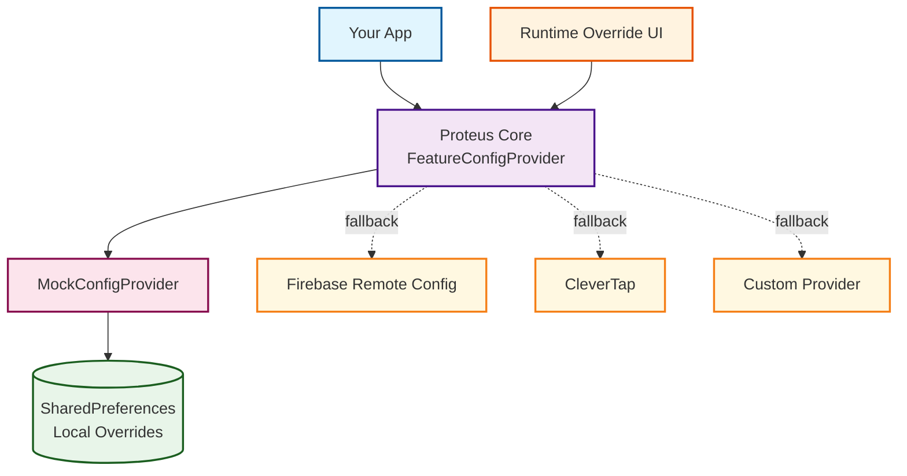

<p align="center">
    <a href="LICENSE"></a>
    <a href="https://android-arsenal.com/api?level=23"></a>
    <a href="https://github.com/maxim-petlyuk/proteus-config/actions"></a>
    <a href="https://github.com/maxim-petlyuk/proteus/tree/main/docs"></a>
    <a href="https://github.com/maxim-petlyuk"></a><br>
    <a href="https://search.maven.org/artifact/io.github.maxim-petlyuk/proteus-core"></a>
    <a href="https://search.maven.org/artifact/io.github.maxim-petlyuk/proteus-firebase"></a>
    <a href="https://search.maven.org/artifact/io.github.maxim-petlyuk/proteus-ui"></a>
    <a href="https://search.maven.org/artifact/io.github.maxim-petlyuk/proteus-bom"></a>
</p>

<div>
Proteus is an Android library for managing remote configurations with runtime override capabilities. It provides a type-safe abstraction
layer over remote config providers like Firebase, enabling teams to test feature flags and A/B variants instantly without server
deployments. The built-in Material Design 3 UI allows you to modify configurations directly on your device during development and testing.
With multi-module architecture and BOM support, Proteus seamlessly integrates into any Android application.
</div>

## Why Proteus?

**The Problem:** Testing remote configurations requires server deployments, slowing down your development cycle and making A/B testing
tedious.

**The Solution:** Proteus provides a runtime override UI that lets you instantly test any configuration scenario without waiting for backend
changes.

**Unique Value:** Test feature flags, A/B variants, and remote configs in real-time directly on your device - no server round-trips
required.

## How it looks like?

<p align="center">


</p>

## Key Features

- **Runtime Configuration Override** - Modify remote configs instantly through a polished local UI
- **Multi-Provider Support** - Seamlessly integrate with Firebase, CleverTap, or custom providers
- **Material Design 3** - Beautiful beige-themed UI that follows the latest design guidelines
- **Multi-Module Architecture** - Independent versioning with BOM support for simplified dependency management
- **Production-Ready** - Comprehensive error handling, thread-safe operations, and coroutines support

## Packages

| Package | Description |
|---------|-------------|
| [proteus-core](https://search.maven.org/artifact/io.github.maxim-petlyuk/proteus-core) | Core abstraction layer for remote configuration providers |
| [proteus-firebase](https://search.maven.org/artifact/io.github.maxim-petlyuk/proteus-firebase) | Firebase Remote Config provider implementation |
| [proteus-ui](https://search.maven.org/artifact/io.github.maxim-petlyuk/proteus-ui) | Material Design 3 UI for runtime configuration overrides |
| [proteus-bom](https://search.maven.org/artifact/io.github.maxim-petlyuk/proteus-bom) | Bill of Materials for consistent version management |

## Installation

### Using BOM (Recommended)

<a href="https://search.maven.org/artifact/io.github.maxim-petlyuk/proteus-bom"></a>

The Bill of Materials (BOM) ensures all Proteus modules use compatible versions:

```toml
[versions]
proteus = "$version"

[libraries]
proteus-bom = { module = "io.github.maxim-petlyuk:proteus-bom", version.ref = "proteus" }
proteus-core = { module = "io.github.maxim-petlyuk:proteus-core" }
proteus-firebase = { module = "io.github.maxim-petlyuk:proteus-firebase" }
proteus-ui = { module = "io.github.maxim-petlyuk:proteus-ui" }

[bundles]
proteus = ["proteus-core", "proteus-firebase", "proteus-ui"]
```

Then in your build.gradle.kts:

```kotlin
dependencies {
    implementation(platform(libs.proteus.bom))
    implementation(libs.bundles.proteus)
}
```

### Requirements

- **Minimum Android SDK**: 23
- **Jetpack Compose**: Required for proteus-ui module only

## Quick Start

Get Proteus up and running in minutes with this minimal example:
#### 1. Initialized first:

```kotlin
class MainApp : Application() {

    override fun onCreate() {
        super.onCreate()

        /* IMPORTANT: Initialize Firebase Remote Config BEFORE using FirebaseOnlyProviderFactory */

        // Initialize Proteus with your feature definitions
        Proteus.Builder(this)
            .registerConfigProviderFactory(FirebaseOnlyProviderFactory())
            .registerFeatureBookDataSource(
                // Option A: Load from assets/features.json
                AssetsFeatureBookDataSource(this, "features.json")
                // Option B: Use runtime code
                // StaticFeatureBookDataSource()
            )
            .build()
    }
}
```

#### 2. Build Proteus config provider
```kotlin
val provider = Proteus.getInstance().buildConfigProvider()
```

#### 3. Access configuration values anywhere in your app
```kotlin
val darkModeEnabled = provider.getBoolean("dark_mode_enabled")
val maxItems = provider.getLong("max_items_per_page")
```

#### 4. Show Proteus library UI for overriding remote config
```kotlin
startActivity(Intent(this, FeatureBookActivity::class.java))
```

## Data Source Options

#### Option A: JSON file in assets folder

Create `assets/features.json`:
```json
[
  {
    "feature_key": "dark_mode_enabled",
    "default_value": "false",
    "value_type": "boolean"
  },
  {
    "feature_key": "max_items_per_page",
    "default_value": "20",
    "value_type": "long"
  }
]
```

Then register it during initialization:
```kotlin
Proteus.Builder(this)
    .registerConfigProviderFactory(FirebaseOnlyProviderFactory())
    .registerFeatureBookDataSource(AssetsFeatureBookDataSource(context = this, jsonFilePath = "features.json"))
    .build()
```

#### Option B: Runtime code

Create a custom data source with your feature definitions:

```kotlin
class SampleFeatureBookDataSource : FeatureBookDataSource {

    override suspend fun getFeatureBook(): Result<List<FeatureContext<*>>> {
        return Result.success(
            listOf(
                Feature(
                    key = "dark_mode_enabled",
                    defaultValue = false,
                    valueClass = Boolean::class
                ),
                Feature(
                    key = "max_items_per_page",
                    defaultValue = 20L,
                    valueClass = Long::class
                ),
                Feature(
                    key = "api_timeout_seconds",
                    defaultValue = 30L,
                    valueClass = Long::class
                ),
                Feature(
                    key = "animation_duration_multiplier",
                    defaultValue = 1.0,
                    valueClass = Double::class
                ),
                Feature(
                    key = "primary_server_url",
                    defaultValue = "https://api.production.com",
                    valueClass = String::class
                )
            )
        )
    }
}
```

Then register it during initialization:
```kotlin
Proteus.Builder(this)
    .registerConfigProviderFactory(FirebaseOnlyProviderFactory())
    .registerFeatureBookDataSource(SampleFeatureBookDataSource())
    .build()
```

## Firebase Remote Config Migration

### Before: Direct Firebase Remote Config Usage

```kotlin
class FeatureManager(
    private val remoteConfig : FirebaseRemoteConfig
) {

    fun isDarkModeEnabled(): Boolean {
        return remoteConfig.getBoolean("dark_mode_enabled")
    }

    fun getApiUrl(): String {
        return remoteConfig.getString("primary_server_url")
    }
}
```

### After: Using Proteus

```kotlin
class FeatureManager(
    private val configProvider: FeatureConfigProvider
) {

    // Runtime override available via UI
    fun isDarkModeEnabled(): Boolean {
        return configProvider.getBoolean("dark_mode_enabled")
    }

    // Switch between servers instantly for testing
    fun getApiUrl(): String {
        return configProvider.getString("primary_server_url")
    }
}
```

### Key Benefits

| Aspect | Before (Firebase only) | After (Proteus) |
|--------|------------------------|-----------------|
| **Testing Speed** | Minutes (Firebase Console changes) | Instant (runtime UI) |
| **Override Capability** | None | Full runtime override |
| **A/B Testing** | Requires Firebase Console setup | Test locally first |
| **Debug Features** | Switch between Firebase Console & app | Visual UI directly in app |
| **Development Workflow** | Firebase Console dependent | Independent local testing |

## Core Concepts

### Architecture Overview

Proteus uses a layered architecture with runtime override capabilities:



### Key Components

- **Proteus** - Central singleton that coordinates the entire system
- **FeatureConfigProvider** - Type-safe interface for configuration access
- **FeatureBookDataSource** - Defines all available features and their metadata
- **MockConfigProvider** - Enables runtime overrides via local storage
- **ConfigValue** - Type-safe wrapper ensuring correct value types

### Provider Abstraction

All configuration providers implement a simple, type-safe interface:

```kotlin
interface FeatureConfigProvider {
    fun getBoolean(featureKey: String): Boolean
    fun getString(featureKey: String): String
    fun getLong(featureKey: String): Long
    fun getDouble(featureKey: String): Double
}
```

### Runtime Override Mechanism

The override mechanism follows a simple priority system:

1. **Check Local Override**: First checks `MockConfigProvider` for user-overridden values
2. **Fallback to Remote**: If no override exists, fetches from remote provider (Firebase, etc.)
3. **Type Safety**: `ConfigValue` sealed class ensures type-safe value handling
4. **Persistence**: Overrides are persisted in SharedPreferences across app sessions

```kotlin
// How FeatureConfigProviderImpl resolves values
fun getBoolean(featureKey: String): Boolean {
    return try {
        mockConfigProvider.getBoolean(featureKey)  // Check override first
    } catch (e: MockConfigUnavailableException) {
        remoteProvider.getBoolean(featureKey)      // Fallback to remote
    }
}
```

### Feature Definition

Features are defined with strong typing and default values:

```kotlin
data class Feature<DataType : Any>(
    val key: String,                    // Unique identifier
    val defaultValue: DataType,         // Fallback value
    val valueClass: KClass<DataType>    // Type information
)

// Example usage
Feature(
    key = "dark_mode_enabled",
    defaultValue = false,
    valueClass = Boolean::class
)
```

### Configuration Lifecycle

1. **Initialization**: App registers providers and data sources with `Proteus.Builder`
2. **Feature Discovery**: `FeatureBookDataSource` provides all feature definitions
3. **Value Resolution**: Provider checks overrides, then remote sources
4. **Runtime Override**: UI allows instant value changes during development
5. **Persistence**: Changes are saved and restored on next app launch

## Advanced Features

### Custom Provider Implementation

Create your own configuration provider for any backend system:

#### 1. Implement the FeatureConfigProvider Interface

```kotlin
class CustomConfigProvider(
    private val apiClient: YourApiClient
) : FeatureConfigProvider {

    override fun getBoolean(featureKey: String): Boolean {
        return apiClient.getConfig(featureKey)?.toBoolean() ?: false
    }

    override fun getString(featureKey: String): String {
        return apiClient.getConfig(featureKey) ?: ""
    }

    override fun getLong(featureKey: String): Long {
        return apiClient.getConfig(featureKey)?.toLongOrNull() ?: 0L
    }

    override fun getDouble(featureKey: String): Double {
        return apiClient.getConfig(featureKey)?.toDoubleOrNull() ?: 0.0
    }
}
```

#### 2. Create a Provider Factory

```kotlin
class CustomProviderFactory(
    private val apiClient: YourApiClient
) : FeatureConfigProviderFactory {

    private val provider = CustomConfigProvider(apiClient)

    override fun getProvider(featureKey: String): FeatureConfigProvider {
        return provider
    }

    override fun getProviderTag(featureKey: String): String {
        return "custom"
    }
}
```

#### 3. Register with Proteus

```kotlin
Proteus.Builder(context)
    .registerConfigProviderFactory(CustomProviderFactory(apiClient))
    .registerFeatureBookDataSource(dataSource)
    .build()
```

#### Dependency Injection Setup

Using Hilt/Dagger for dependency injection:

```kotlin
@Module
@InstallIn(SingletonComponent::class)
object ProteusModule {

    @Provides
    @Singleton
    fun provideProteus(@ApplicationContext context: Context): Proteus {
        return Proteus.Builder(context)
            .registerConfigProviderFactory(FirebaseOnlyProviderFactory())
            .registerFeatureBookDataSource(
                AssetsFeatureBookDataSource(context, "features.json")
            )
            .build()
    }

    @Provides
    @Singleton
    fun provideFeatureConfigProvider(proteus: Proteus): FeatureConfigProvider {
        return proteus.buildConfigProvider()
    }
}
```

### ProGuard/R8 Configuration

Proteus modules include consumer ProGuard rules automatically. For additional safety, you can add:

```pro
# Proteus
-keep class io.proteus.** { *; }
-keep class io.proteus.core.domain.** { *; }
-keepattributes *Annotation*

# Keep your custom providers
-keep class com.yourpackage.CustomConfigProvider { *; }
-keep class com.yourpackage.CustomProviderFactory { *; }
```

### Performance Considerations

- **Caching**: Provider implementations should cache values to avoid repeated network/disk operations
- **Lazy Loading**: Initialize Proteus in `Application.onCreate()` for immediate availability
- **Thread Safety**: All Proteus providers are thread-safe by design
- **Memory Usage**: Override values in SharedPreferences have minimal memory impact
- **Network Optimization**: Batch fetch configurations when using custom API providers

## Community

### Contributing

We welcome contributions! Please see our [Contributing Guide](CONTRIBUTING.md) for details on:
- Code style and guidelines
- Pull request process
- Issue reporting
- Development environment setup

### Issues and Support

- **Bug Reports**: [Create an issue](https://github.com/maxim-petlyuk/proteus/issues/new?template=bug_report.md)
- **Feature Requests**: [Request a feature](https://github.com/maxim-petlyuk/proteus/issues/new?template=feature_request.md)
- **Questions**: [Ask in Discussions](https://github.com/maxim-petlyuk/proteus/discussions)

### Connect

- **GitHub**: [@maxim-petlyuk](https://github.com/maxim-petlyuk)
- **Issues**: [proteus/issues](https://github.com/maxim-petlyuk/proteus/issues)

## Find this library useful? ⭐

Support it by joining [**stargazers**](https://github.com/maxim-petlyuk/proteus/stargazers) for this repository. ⭐
And [**follow**](https://github.com/maxim-petlyuk) me for my next creations! 🤩

## License

```
Copyright 2025 Maxim Petlyuk

Licensed under the Apache License, Version 2.0 (the "License");
you may not use this file except in compliance with the License.
You may obtain a copy of the License at

    http://www.apache.org/licenses/LICENSE-2.0

Unless required by applicable law or agreed to in writing, software
distributed under the License is distributed on an "AS IS" BASIS,
WITHOUT WARRANTIES OR CONDITIONS OF ANY KIND, either express or implied.
See the License for the specific language governing permissions and
limitations under the License.
```
