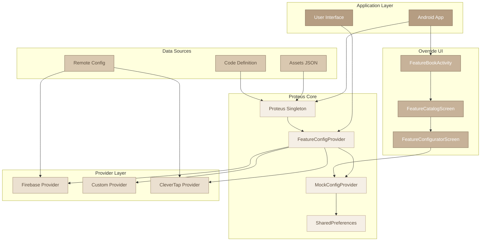
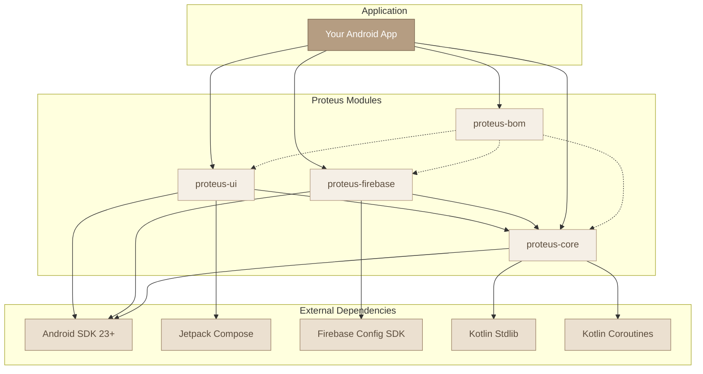
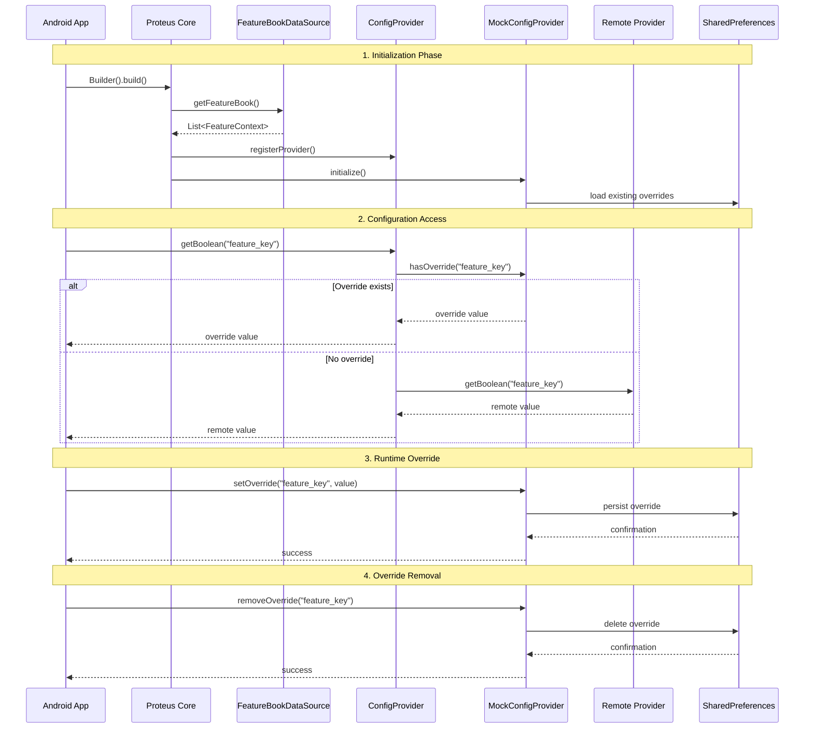
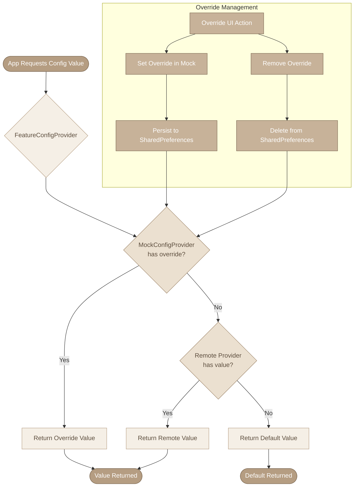

# Proteus Architecture

This document provides a comprehensive overview of the Proteus architecture, including high-level design, module dependencies, configuration lifecycle, and runtime override mechanisms.

## Overview

Proteus is a multi-module Android library that provides A/B testing and remote configuration capabilities with runtime override functionality. The architecture is designed to be:

- **Modular**: Independent modules with clear responsibilities
- **Extensible**: Support for custom providers and data sources
- **Type-safe**: Strongly-typed configuration access
- **Testable**: Runtime override capabilities for testing

## High-Level Architecture

The system consists of four main layers:

### Key Components

1. **Application Layer**: Your Android app and UI components
2. **Proteus Core**: Central coordination and abstraction layer
3. **Provider Layer**: Different remote config implementations
4. **Data Sources**: Feature definitions and remote configurations
5. **Override UI**: Runtime configuration management interface

## Module Dependencies

### Dependency Rules

- **proteus-core**: Always required, minimal dependencies
- **proteus-firebase**: Requires proteus-core + Firebase Config SDK
- **proteus-ui**: Requires proteus-core + Jetpack Compose
- **proteus-bom**: Optional but recommended for version management

## Configuration Lifecycle

The configuration system follows a well-defined lifecycle:

### Lifecycle Phases

1. **Initialization**: App sets up Proteus with providers and data sources
2. **Feature Discovery**: Load feature definitions from assets or code
3. **Provider Registration**: Register remote config providers
4. **Override Loading**: Load existing overrides from SharedPreferences
5. **Runtime Access**: App requests configuration values
6. **Value Resolution**: Check overrides first, fallback to remote
7. **Override Management**: Runtime changes via UI or programmatically

## Runtime Override Flow

The override mechanism provides priority-based value resolution:

### Override Priority

1. **Mock Override** (Highest Priority) - Set via UI or programmatically
2. **Remote Provider Value** (Medium Priority) - Firebase, Custom providers
3. **Default Value** (Lowest Priority) - Defined in feature definition

## Design Principles

### Modularity
Each module has a single, well-defined responsibility:
- **proteus-core**: Core abstractions and interfaces
- **proteus-firebase**: Firebase Remote Config integration
- **proteus-ui**: Material Design override interface

### Extensibility
The system supports custom implementations:
- Custom provider factories
- Custom data sources
- Custom configuration sources

### Type Safety
Strong typing prevents configuration errors:
- `ConfigValue` sealed class for type safety
- Compile-time type checking
- Runtime type validation

### Testing
Built-in testing capabilities:
- Mock provider for overrides
- Runtime configuration changes
- UI for manual testing

## Performance Considerations

### Memory Usage
- Singleton pattern minimizes instance overhead
- Lazy loading of providers
- Efficient caching of configuration values

### Storage
- SharedPreferences for lightweight persistence
- JSON serialization for complex values
- Automatic cleanup of unused overrides

### Network
- Provider-specific optimization
- Caching strategies vary by provider
- Background refresh capabilities

## Security Considerations

### Production Safety
- Override UI should be disabled in release builds
- No sensitive data in feature definitions
- Secure provider implementations

### Data Protection
- Local storage encryption (provider-dependent)
- Network security follows provider standards
- No logging of sensitive configuration values

## Migration & Compatibility

### Version Compatibility
- Semantic versioning across all modules
- BOM ensures compatible versions
- Clear migration guides for breaking changes

### Provider Migration
- Gradual migration between providers
- Fallback mechanisms during transition
- Data export/import capabilities

---

## Further Reading

- [High-Level Architecture](architecture/high-level-architecture.md)
- [Module Dependencies](architecture/module-dependency-graph.md)
- [Configuration Lifecycle](architecture/configuration-lifecycle.md)
- [Runtime Override Flow](architecture/runtime-override-flow.md)

## Contributing

For architecture-related discussions or proposals, please:
1. Review existing architecture documents
2. Open a GitHub Discussion for design questions
3. Submit PRs with architecture updates when needed

---

*Last updated: December 2024*
*Version: 1.0*