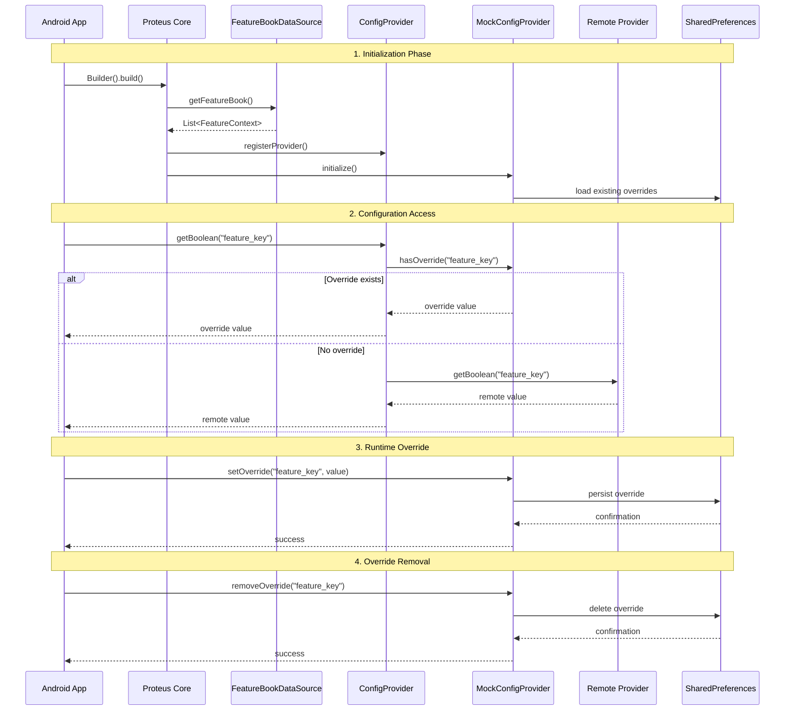

# Configuration Lifecycle

## Lifecycle Phases

1. **Initialization**: App sets up Proteus with providers and data sources
2. **Feature Discovery**: Load feature definitions from assets or code
3. **Provider Registration**: Register remote config providers
4. **Override Loading**: Load existing overrides from SharedPreferences
5. **Runtime Access**: App requests configuration values
6. **Value Resolution**: Check overrides first, fallback to remote
7. **Override Management**: Runtime changes via UI or programmatically