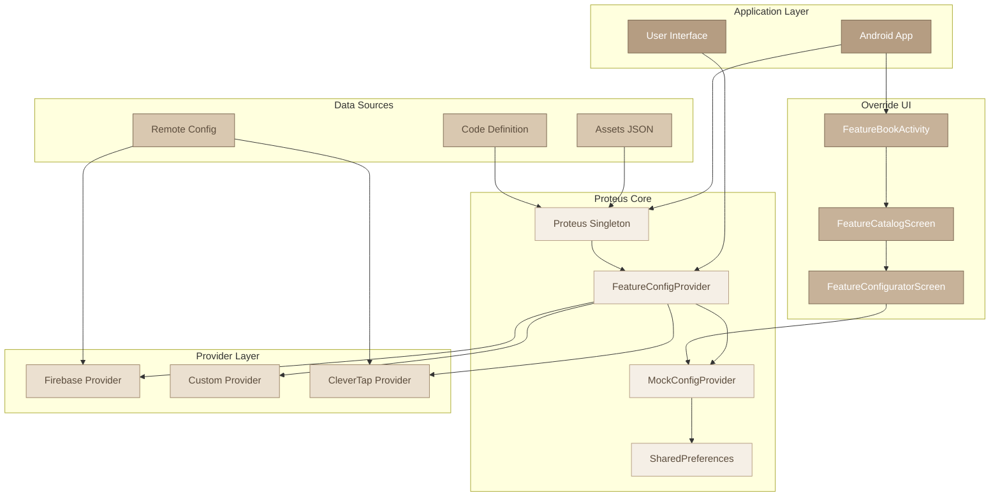

# High-Level Architecture

## Key Components

- **Application Layer**: Your Android app and UI components
- **Proteus Core**: Central coordination and abstraction layer
- **Provider Layer**: Different remote config implementations
- **Data Sources**: Feature definitions and remote configurations
- **Override UI**: Runtime configuration management interface

## Data Flow

1. App initializes Proteus with providers and data sources
2. Configuration requests flow through FeatureConfigProvider
3. MockConfigProvider checks for overrides first
4. Falls back to remote providers (Firebase, Custom, etc.)
5. Override UI allows runtime configuration changes