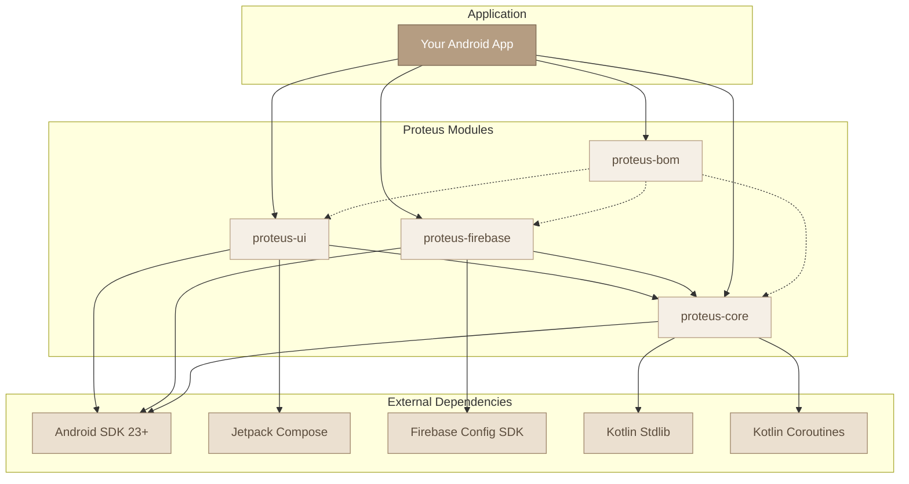

# Module Dependency Graph

## Dependency Rules

### Required Dependencies
- **proteus-core**: Always required, no external dependencies beyond Android SDK
- **proteus-firebase**: Requires proteus-core + Firebase Config SDK
- **proteus-ui**: Requires proteus-core + Jetpack Compose

### Optional Dependencies
- Use **proteus-bom** for version management (recommended)
- Choose specific provider modules based on your needs

### Minimum Requirements
- Android SDK 23+
- Kotlin 1.8+
- Target SDK 34+