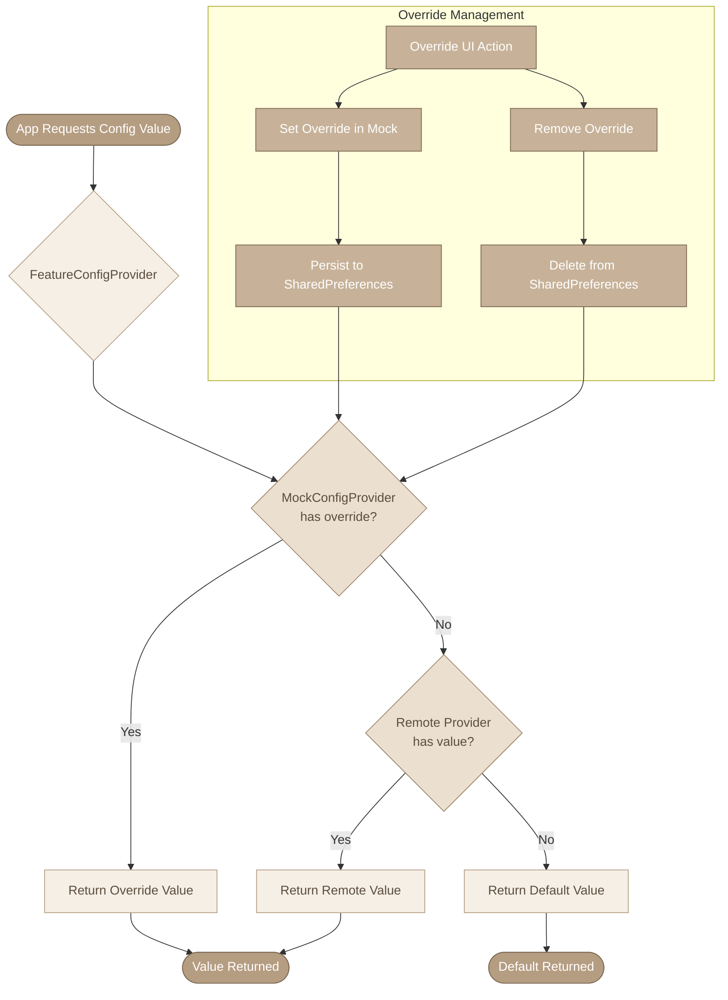

# Runtime Override Flow

## Override Priority

1. **Mock Override** (Highest Priority)
   - Set via UI or programmatically
   - Persisted in SharedPreferences
   - Survives app restarts

2. **Remote Provider Value** (Medium Priority)
   - Firebase Remote Config
   - Custom provider implementation
   - CleverTap or other services

3. **Default Value** (Lowest Priority)
   - Defined in feature definition
   - Used when no override or remote value exists
   - Ensures app never crashes from missing config

## Persistence

- Overrides are stored in SharedPreferences
- Key format: `proteus_override_{feature_key}`
- Values are serialized as JSON with type information
- Cleared when override is explicitly removed